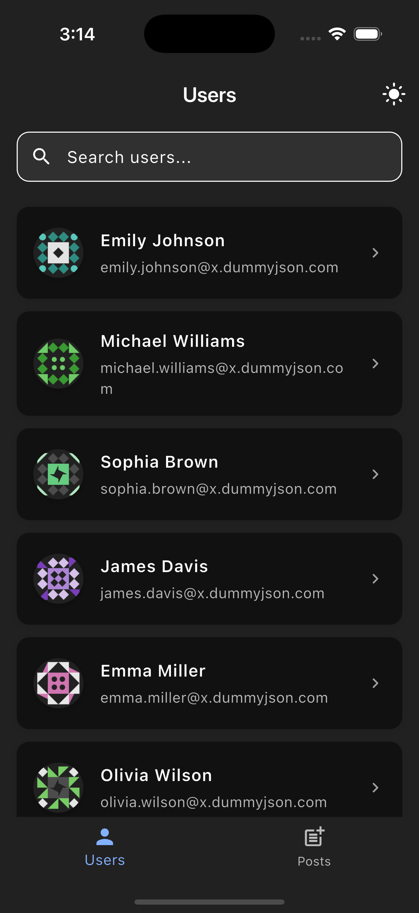

# bloc_assignment

A Flutter project demonstrating state management using BLoC pattern.

[Demo Video](https://youtube.com/shorts/eA7oK6uFjps?feature=share)

## Project Overview

This application showcases the implementation of BLoC (Business Logic Component) pattern in Flutter. It manages state effectively by separating the business logic from the UI components.

## Architecture

The project follows a clean architecture approach with the following layers:

- **Presentation Layer**: Contains UI components (widgets) and BLoC implementations
- **Domain Layer**: Houses the business logic and use cases
- **Data Layer**: Manages data operations and external services

### BLoC Architecture Implementation

The project implements BLoC (Business Logic Component) pattern with the following components:

1. **Blocs**:
   - `ThemeBloc`: Manages app theme state
   - `PostsBloc`: Handles operations related to locally created posts, stored via SharedPreferences
   - `UsersBloc`: Manages user data with pagination and search functionality
     - Handles initial user fetch
     - Implements infinite scroll with pagination
     - Provides search functionality
     - Maintains list of users with skip/limit pattern

2. **Events**:
   - Events are the input to a Bloc
   - They are dispatched in response to user interactions
   - Example Events:
     - Theme: `InitializeTheme`, `ToggleTheme`
     - Users: `UsersInitialFetch`, `UsersLoadMore`, `UsersSearchEvent`

3. **States**:
   - Represent the output of a Bloc
   - UI updates based on state changes
   - Example States:
     - Theme: `ThemeState(isDarkMode: bool)`
     - Users: `UsersFetchingSuccessfulState`, `UsersFetchingLoadingState`

4. **Flow**:
```
User Action → Event → Bloc → State → UI Update
```

The BLoC pattern implementation ensures:
- Unidirectional data flow
- Separation of concerns
- Testable components
- Scalable architecture
- Efficient pagination and search functionality

## Setup Instructions

1. **Prerequisites**
   - Flutter SDK (version 3.0 or higher)
   - Dart SDK (version 2.17 or higher)
   - Android Studio / VS Code
   - Git

2. **Installation Steps**
   ```bash
   # Clone the repository
   git clone [repository-url]

   # Navigate to project directory
   cd bloc-assignment

   # Install dependencies
   flutter pub get

   # Run the app
   flutter run
   ```

3. **Configuration**
   - Ensure you have a working emulator or connected device

## Demo & Screenshots

### Demo Video
Watch the demo video to see the app in action:

[](https://youtube.com/shorts/eA7oK6uFjps)

### Screenshots

<div style="display: flex; flex-wrap: wrap; gap: 10px;">

#### Light Theme
<p float="left">
  
  
  
  
</p>

#### Dark Theme
<p float="left">
  
  
  
  
</p>

</div>

### Key Features Demonstrated
- Theme switching between light and dark mode
- User list with infinite scroll
- Search functionality
- Local post creation and storage
- Responsive UI design

